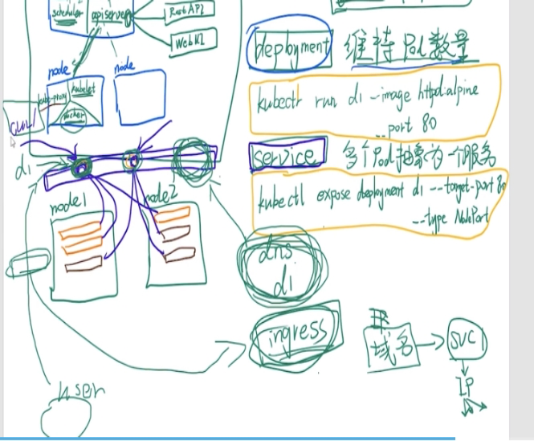
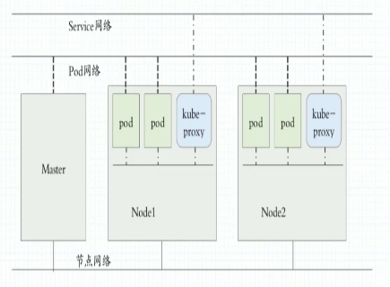

组件：

- 存储中心：etcd
- 主控节点（Master）：
  - cube-apiserver：restful 接口，鉴权（RBAC）、数据校验，通信枢纽
  - controller-manage：一系列控制组成：Node、Deployment、Service、Volume、Endpoint、Garbage、Namespace、Job、Resource Quta，通过 apiserver 监控集群状态
  - scheduler：调度 pod 到适当的运算节点上，1. 预算策略（predict） 2. 优先策略（priorities）
- 运算节点（Node）：
  - kubectl：指定容器、数量、网络、存储等等达到期望状态，汇报当前节点状态给 apiserver
  - proxy：pod 网络和集群网络之间的代理（cluster ip -> pod ip），流量调度及管控（iptables、ipvs），

附件：

- CNI 网络插件：flannel、calico
- 服务发现插件：coredns
- 服务暴露插件：traefik
- GUI管理插件：Dashboard

https://github-readme-stats.vercel.app/api?username=LeoL1an

https://github-profile-trophy.vercel.app?username=LeoL1an&theme=flat&column=7

